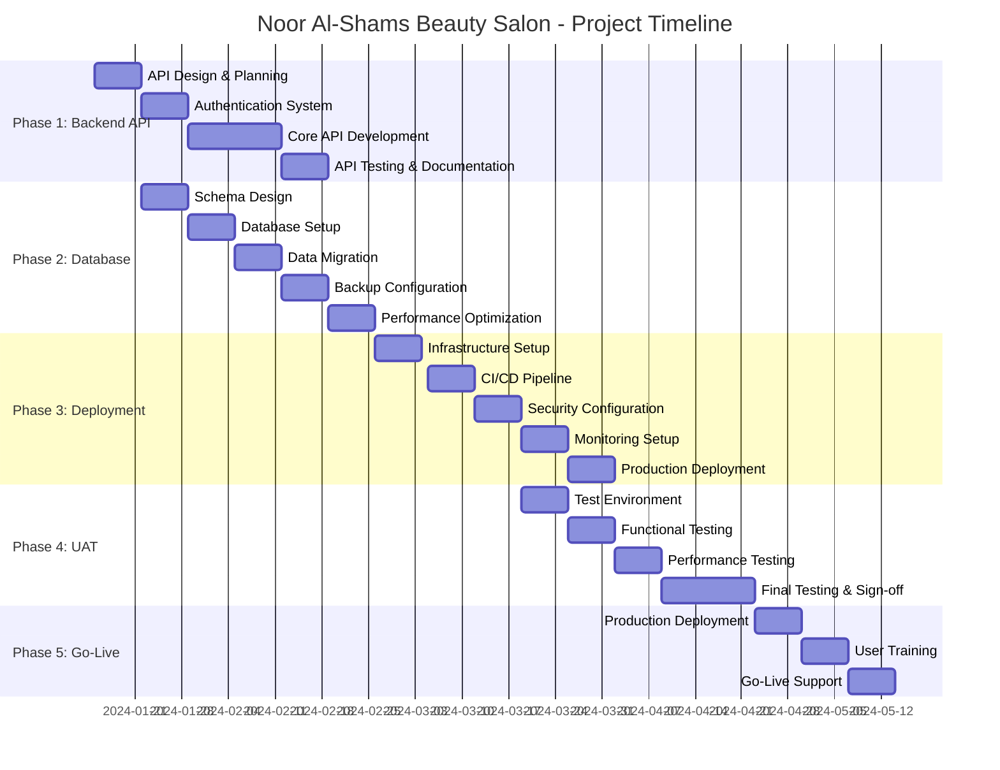

# 📅 Project Timeline & Resource Allocation

## 🎯 Project Overview

**Project Name:** Noor Al-Shams Beauty Salon Management System  
**Total Duration:** 16 weeks (12 weeks development + 4 weeks buffer)  
**Start Date:** January 15, 2024  
**Go-Live Date:** May 6, 2024  
**Team Size:** 8-10 professionals  

---

## 📊 High-Level Timeline

---

## 📋 Detailed Phase Breakdown

### Phase 1: Backend API Integration (Weeks 1-4)

#### Week 1: API Design & Planning
**Duration:** January 15-21, 2024

**Objectives:**
- Finalize API architecture and design patterns
- Create comprehensive API documentation
- Set up development environment
- Establish coding standards and guidelines

**Deliverables:**
- [ ] API specification document
- [ ] Database schema design
- [ ] Development environment setup
- [ ] Code review guidelines
- [ ] Security requirements document

**Team Allocation:**
- Senior Backend Developer (40 hours)
- Backend Developer (40 hours)
- System Architect (20 hours)
- Project Manager (10 hours)

**Key Milestones:**
- ✅ API endpoints defined
- ✅ Authentication strategy finalized
- ✅ Database relationships mapped
- ✅ Development environment ready

---

#### Week 2: Authentication System
**Duration:** January 22-28, 2024

**Objectives:**
- Implement JWT-based authentication
- Create user registration and login endpoints
- Set up role-based access control
- Implement password security measures

**Deliverables:**
- [ ] User authentication API
- [ ] JWT token management
- [ ] Password hashing and validation
- [ ] Role-based middleware
- [ ] Email verification system

**Team Allocation:**
- Senior Backend Developer (40 hours)
- Backend Developer (30 hours)
- Security Specialist (20 hours)

**Key Milestones:**
- ✅ User registration working
- ✅ Login/logout functionality
- ✅ Password reset mechanism
- ✅ Role-based access implemented

---

#### Week 3-4: Core API Development
**Duration:** January 29 - February 11, 2024

**Objectives:**
- Develop all core business logic APIs
- Implement booking management system
- Create service and staff management endpoints
- Build notification system

**Deliverables:**
- [ ] Booking management API
- [ ] Service management API
- [ ] Staff management API
- [ ] User profile management API
- [ ] Notification system API
- [ ] Payment integration API

**Team Allocation:**
- Senior Backend Developer (80 hours)
- Backend Developer (80 hours)
- Database Developer (40 hours)

**Key Milestones:**
- ✅ All CRUD operations implemented
- ✅ Business logic validated
- ✅ API integration tested
- ✅ Error handling implemented

---

### Phase 2: Database Configuration (Weeks 2-6)

#### Week 2-3: Database Design & Setup
**Duration:** January 22 - February 4, 2024

**Objectives:**
- Implement database schema
- Set up production and staging databases
- Configure connection pooling
- Implement data validation

**Deliverables:**
- [ ] Production database setup
- [ ] Staging database setup
- [ ] Database schema implementation
- [ ] Connection pool configuration
- [ ] Data validation rules

**Team Allocation:**
- Database Administrator (60 hours)
- Backend Developer (40 hours)
- DevOps Engineer (20 hours)

**Key Milestones:**
- ✅ Database schema deployed
- ✅ Connection pooling optimized
- ✅ Data integrity constraints
- ✅ Performance benchmarks met

---

#### Week 4-5: Data Migration & Optimization
**Duration:** February 5-18, 2024

**Objectives:**
- Migrate existing data (if any)
- Optimize database performance
- Implement backup procedures
- Set up monitoring and alerting

**Deliverables:**
- [ ] Data migration scripts
- [ ] Performance optimization
- [ ] Backup automation
- [ ] Database monitoring
- [ ] Recovery procedures

**Team Allocation:**
- Database Administrator (60 hours)
- DevOps Engineer (40 hours)
- Backend Developer (20 hours)

**Key Milestones:**
- ✅ Data migration completed
- ✅ Performance optimized
- ✅ Backup system operational
- ✅ Monitoring alerts configured

---

### Phase 3: Production Deployment (Weeks 6-10)

#### Week 6-7: Infrastructure Setup
**Duration:** February 26 - March 10, 2024

**Objectives:**
- Set up production servers
- Configure load balancing
- Implement SSL certificates
- Set up CDN and caching

**Deliverables:**
- [ ] Production server setup
- [ ] Load balancer configuration
- [ ] SSL certificate installation
- [ ] CDN configuration
- [ ] Caching implementation

**Team Allocation:**
- DevOps Engineer (80 hours)
- System Administrator (40 hours)
- Security Specialist (20 hours)

**Key Milestones:**
- ✅ Servers provisioned and configured
- ✅ SSL certificates installed
- ✅ Load balancing operational
- ✅ CDN configured and tested

---

#### Week 8-9: CI/CD Pipeline & Security
**Duration:** March 11-24, 2024

**Objectives:**
- Implement automated deployment pipeline
- Configure security measures
- Set up monitoring and logging
- Implement backup procedures

**Deliverables:**
- [ ] CI/CD pipeline setup
- [ ] Security hardening
- [ ] Monitoring system
- [ ] Log aggregation
- [ ] Backup automation

**Team Allocation:**
- DevOps Engineer (60 hours)
- Security Specialist (40 hours)
- System Administrator (20 hours)

**Key Milestones:**
- ✅ Automated deployment working
- ✅ Security measures implemented
- ✅ Monitoring operational
- ✅ Backup system tested

---

#### Week 10: Production Deployment
**Duration:** March 25-31, 2024

**Objectives:**
- Deploy application to production
- Perform final security testing
- Conduct performance testing
- Prepare rollback procedures

**Deliverables:**
- [ ] Production deployment
- [ ] Security audit report
- [ ] Performance test results
- [ ] Rollback procedures
- [ ] Go-live checklist

**Team Allocation:**
- DevOps Engineer (40 hours)
- Security Specialist (20 hours)
- QA Engineer (20 hours)
- Project Manager (10 hours)

**Key Milestones:**
- ✅ Application deployed successfully
- ✅ Security audit passed
- ✅ Performance benchmarks met
- ✅ Rollback procedures tested

---

### Phase 4: User Acceptance Testing (Weeks 8-12)

#### Week 8: Test Environment Setup
**Duration:** March 18-24, 2024

**Objectives:**
- Set up UAT environment
- Create test data and scenarios
- Train testing team
- Prepare test documentation

**Deliverables:**
- [ ] UAT environment ready
- [ ] Test data created
- [ ] Test scenarios documented
- [ ] Team training completed
- [ ] Bug tracking system setup

**Team Allocation:**
- QA Engineer (40 hours)
- Business Analyst (20 hours)
- DevOps Engineer (20 hours)
- UAT Coordinator (20 hours)

**Key Milestones:**
- ✅ UAT environment operational
- ✅ Test data populated
- ✅ Testing team trained
- ✅ Test plan approved

---

#### Week 9-10: Functional Testing
**Duration:** March 25 - April 7, 2024

**Objectives:**
- Execute all functional test cases
- Test user workflows and scenarios
- Validate business requirements
- Document and track bugs

**Deliverables:**
- [ ] Functional test execution
- [ ] User workflow validation
- [ ] Bug reports and tracking
- [ ] Test progress reports
- [ ] Requirement validation

**Team Allocation:**
- QA Engineers (80 hours)
- Business Users (60 hours)
- UAT Coordinator (40 hours)
- Developer (20 hours - bug fixes)

**Key Milestones:**
- ✅ Core functionality tested
- ✅ User workflows validated
- ✅ Critical bugs resolved
- ✅ Business requirements met

---

#### Week 11-12: Performance & Final Testing
**Duration:** April 8-21, 2024

**Objectives:**
- Conduct performance testing
- Execute security testing
- Perform final user acceptance
- Obtain stakeholder sign-off

**Deliverables:**
- [ ] Performance test results
- [ ] Security test report
- [ ] Final UAT report
- [ ] Stakeholder sign-off
- [ ] Go-live approval

**Team Allocation:**
- QA Engineers (60 hours)
- Performance Tester (40 hours)
- Security Specialist (20 hours)
- Business Stakeholders (40 hours)

**Key Milestones:**
- ✅ Performance requirements met
- ✅ Security testing passed
- ✅ User acceptance achieved
- ✅ Go-live approved

---

## 👥 Resource Allocation

### Core Team Structure

#### Technical Team (6 people)

**Senior Backend Developer**
- **Role:** Lead API development and architecture
- **Allocation:** 100% (16 weeks)
- **Key Responsibilities:**
  - API design and implementation
  - Code review and mentoring
  - Technical decision making
  - Integration oversight

**Backend Developer**
- **Role:** API development and testing
- **Allocation:** 100% (12 weeks)
- **Key Responsibilities:**
  - Feature implementation
  - Unit testing
  - Bug fixes
  - Documentation

**Database Administrator**
- **Role:** Database design and optimization
- **Allocation:** 75% (8 weeks)
- **Key Responsibilities:**
  - Schema design
  - Performance tuning
  - Backup procedures
  - Security implementation

**DevOps Engineer**
- **Role:** Infrastructure and deployment
- **Allocation:** 100% (10 weeks)
- **Key Responsibilities:**
  - Server setup and configuration
  - CI/CD pipeline
  - Monitoring and logging
  - Security hardening

**QA Engineer (2 people)**
- **Role:** Testing and quality assurance
- **Allocation:** 100% (8 weeks)
- **Key Responsibilities:**
  - Test planning and execution
  - Bug tracking and reporting
  - UAT coordination
  - Quality metrics

#### Support Team (4 people)

**Project Manager**
- **Role:** Project coordination and management
- **Allocation:** 50% (16 weeks)
- **Key Responsibilities:**
  - Timeline management
  - Resource coordination
  - Stakeholder communication
  - Risk management

**Business Analyst**
- **Role:** Requirements and UAT support
- **Allocation:** 50% (8 weeks)
- **Key Responsibilities:**
  - Requirement validation
  - UAT planning
  - User training
  - Documentation

**Security Specialist**
- **Role:** Security implementation and testing
- **Allocation:** 25% (12 weeks)
- **Key Responsibilities:**
  - Security architecture
  - Penetration testing
  - Compliance validation
  - Security training

**System Administrator**
- **Role:** Infrastructure support
- **Allocation:** 25% (8 weeks)
- **Key Responsibilities:**
  - Server maintenance
  - Backup management
  - Performance monitoring
  - Incident response

---

## 💰 Budget Estimation

### Personnel Costs (16 weeks)

| Role | Rate/Week | Weeks | Total Cost |
|------|-----------|-------|------------|
| Senior Backend Developer | $2,500 | 16 | $40,000 |
| Backend Developer | $2,000 | 12 | $24,000 |
| Database Administrator | $2,200 | 8 | $17,600 |
| DevOps Engineer | $2,300 | 10 | $23,000 |
| QA Engineers (2) | $1,800 | 8 | $28,800 |
| Project Manager | $1,500 | 8 | $12,000 |
| Business Analyst | $1,400 | 4 | $5,600 |
| Security Specialist | $2,000 | 3 | $6,000 |
| System Administrator | $1,600 | 2 | $3,200 |
| **Total Personnel** | | | **$160,200** |

### Infrastructure Costs

| Item | Monthly Cost | Months | Total Cost |
|------|--------------|--------|------------|
| Production Servers (2x) | $400 | 4 | $1,600 |
| Database Server | $300 | 4 | $1,200 |
| Load Balancer | $150 | 4 | $600 |
| CDN Service | $100 | 4 | $400 |
| Monitoring Tools | $200 | 4 | $800 |
| Backup Storage | $100 | 4 | $400 |
| SSL Certificates | $200 | 1 | $200 |
| **Total Infrastructure** | | | **$5,200** |

### Software & Tools

| Item | Cost | Quantity | Total Cost |
|------|------|----------|------------|
| Development Tools | $500 | 6 | $3,000 |
| Testing Tools | $300 | 2 | $600 |
| Project Management | $100 | 4 months | $400 |
| Security Tools | $400 | 1 | $400 |
| **Total Software** | | | **$4,400** |

### Contingency & Miscellaneous

| Item | Cost |
|------|------|
| Contingency (10%) | $17,000 |
| Training & Documentation | $3,000 |
| Third-party Integrations | $2,000 |
| **Total Contingency** | **$22,000** |

### **Total Project Budget: $191,800**

---

## ⚠️ Risk Assessment & Mitigation

### High-Risk Items

#### Technical Risks

**Risk:** API Performance Issues
- **Probability:** Medium (30%)
- **Impact:** High
- **Mitigation:** 
  - Early performance testing
  - Code optimization reviews
  - Caching implementation
  - Load testing from week 6

**Risk:** Database Performance Bottlenecks
- **Probability:** Medium (25%)
- **Impact:** High
- **Mitigation:**
  - Database optimization from day 1
  - Regular performance monitoring
  - Query optimization reviews
  - Scalability planning

**Risk:** Security Vulnerabilities
- **Probability:** Low (15%)
- **Impact:** Critical
- **Mitigation:**
  - Security reviews at each phase
  - Penetration testing
  - Code security audits
  - Compliance validation

#### Project Risks

**Risk:** Resource Availability
- **Probability:** Medium (35%)
- **Impact:** Medium
- **Mitigation:**
  - Cross-training team members
  - Backup resource identification
  - Flexible scheduling
  - Early resource commitment

**Risk:** Scope Creep
- **Probability:** High (40%)
- **Impact:** Medium
- **Mitigation:**
  - Clear requirement documentation
  - Change control process
  - Regular stakeholder reviews
  - Buffer time allocation

**Risk:** Integration Complexity
- **Probability:** Medium (30%)
- **Impact:** Medium
- **Mitigation:**
  - Early integration testing
  - Modular development approach
  - API contract validation
  - Regular integration reviews

---

## 📈 Success Metrics

### Technical Metrics

**Performance Targets:**
- Page load time: < 3 seconds
- API response time: < 1 second
- Database query time: < 500ms
- System uptime: > 99.9%
- Concurrent users: 500+

**Quality Targets:**
- Code coverage: > 80%
- Bug density: < 1 per 1000 lines
- Critical bugs: 0
- Security vulnerabilities: 0
- Performance benchmarks: 100% met

### Business Metrics

**User Adoption:**
- User registration rate: > 100 users/month
- Booking completion rate: > 95%
- User satisfaction score: > 90%
- Staff adoption rate: 100%
- Admin usage frequency: Daily

**Operational Metrics:**
- Deployment success rate: 100%
- Rollback incidents: 0
- Data loss incidents: 0
- Security incidents: 0
- Backup success rate: 100%

---

## 📅 Key Milestones & Checkpoints

### Major Milestones

| Milestone | Date | Deliverables | Success Criteria |
|-----------|------|--------------|------------------|
| **M1: API Foundation** | Feb 11, 2024 | Core APIs, Authentication | All endpoints functional |
| **M2: Database Ready** | Feb 25, 2024 | Schema, Optimization, Backup | Performance targets met |
| **M3: Infrastructure Live** | Mar 31, 2024 | Production deployment | System operational |
| **M4: UAT Complete** | Apr 21, 2024 | Testing, Sign-off | Acceptance criteria met |
| **M5: Go-Live** | May 6, 2024 | Production launch | System live and stable |

### Weekly Checkpoints

**Every Friday at 3:00 PM:**
- Progress review meeting
- Risk assessment update
- Resource allocation review
- Next week planning
- Stakeholder communication

**Checkpoint Agenda:**
1. Completed deliverables review
2. Current week progress assessment
3. Upcoming week planning
4. Risk and issue discussion
5. Resource needs identification
6. Stakeholder updates

---

## 📞 Communication Plan

### Stakeholder Communication

**Weekly Status Reports:**
- **Audience:** Project sponsors, business stakeholders
- **Format:** Email summary with dashboard link
- **Content:** Progress, risks, upcoming milestones
- **Schedule:** Every Monday morning

**Bi-weekly Steering Committee:**
- **Audience:** Executive sponsors, department heads
- **Format:** 1-hour meeting with presentation
- **Content:** High-level progress, major decisions needed
- **Schedule:** Every other Wednesday

**Daily Stand-ups:**
- **Audience:** Development team
- **Format:** 15-minute video call
- **Content:** Yesterday's progress, today's plan, blockers
- **Schedule:** Every weekday at 9:00 AM

### Escalation Matrix

| Level | Contact | Response Time | Issues |
|-------|---------|---------------|--------|
| **L1** | Project Manager | 2 hours | Day-to-day issues |
| **L2** | Technical Lead | 4 hours | Technical blockers |
| **L3** | Program Director | 8 hours | Resource/scope issues |
| **L4** | Executive Sponsor | 24 hours | Critical decisions |

---

## ✅ Go-Live Readiness Checklist

### Technical Readiness
- [ ] All APIs tested and functional
- [ ] Database performance optimized
- [ ] Security measures implemented
- [ ] Backup and recovery tested
- [ ] Monitoring and alerting active
- [ ] Load testing completed
- [ ] SSL certificates installed
- [ ] CDN configured and tested

### Business Readiness
- [ ] User acceptance testing completed
- [ ] Staff training conducted
- [ ] Business processes documented
- [ ] Support procedures established
- [ ] Data migration verified
- [ ] Stakeholder sign-off obtained
- [ ] Go-live communication sent
- [ ] Rollback plan prepared

### Operational Readiness
- [ ] Support team trained
- [ ] Incident response procedures
- [ ] Performance monitoring active
- [ ] Backup procedures tested
- [ ] Security monitoring enabled
- [ ] Change management process
- [ ] Documentation completed
- [ ] Knowledge transfer done

---

*Last Updated: January 15, 2024*  
*Project Timeline Version: 1.0*